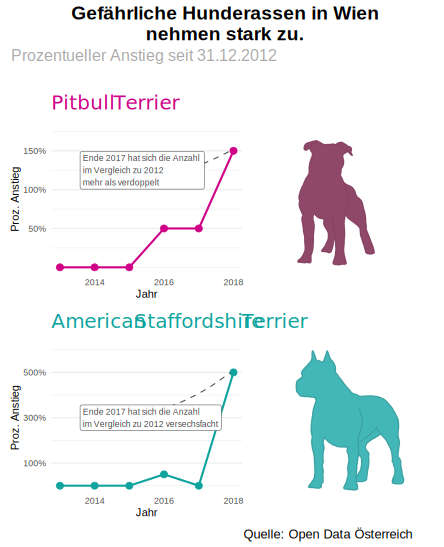

```{r, echo = FALSE}
knitr::opts_chunk$set(
  fig.align = "center",
  echo = FALSE
)
```

Dieses Abgabe wurde im Rahmen der Lehrveranstaltung Visualisierungstechniken ILV S2021 an der Fachhochschule Wiener Neustadt erstellt.

# Visualisierung

<center> </center>

# Dokumentation

Die Visualisierung möchte auf Basis von Daten der Stadt Wien (Quelle: https://www.data.gv.at/katalog/dataset/31f526f5-2cf2-49f8-a63d-0c63a0f87a3e) den Standpunkt hervorheben, dass die Anzahl "gefährlicher Hunderassen" (sprich Listenhunde) in Wien stark zunimmt. Um diesen Standpunkt darzustellen, werden einige "unsaubere Mittel" der Statistik verwendet. 

## In welchen Kapiteln des Buches "So lügt man mit Statistik" (Krämer, 2001) könnte die Grafik als Beispiel genannt werden?

* **Protzige Prozente**: Es werden in der Visualiserung nur relative Zahlen angegeben. In absoluten Zahlen wäre die Botschaft der Grafik weitaus weniger "alarmierend". So stieg die Anzahl von American Staffordshire Terriern tatsächlich von 2 auf 12 Tiere und die Anzahl von Pitbull Terriern von 2 auf 5 Tiere. Von Krämer (2001) wird diese Verzerrung wie folgt treffend beschrieben: Das "Verstecken kleiner Zahlen hinter imponierenden Prozenten [...]". Außerdem spricht die Visualiersung von *prozentuellem Anstieg*, wobei der Begriff "prozentuell" nach Krämer (2001) den Betracher*innen der Grafik Seriosität suggeriert.
* **Vorsicht, Kurve**: Durch das Seitenverhältnis der Visualisierung wirken die Veränderungen optisch noch drastischer (Winkel der Linien in den Diagrammen sind tendeziell steiler). Diesen Effekt könnte man durch weiteres Stauchen der x-Achse und Datenpunkte "außerhalb des Plots" noch weiter überzeichnen.
* **Trügerische Trends**: Durch die Beschriftung der Grafik wird im Allgemeinen ein Trend zum Anstieg der jeweiligen Hunderassen impliziert. So ist nicht neutral von "Veränderung" die Rede, sondern es wird nur von "Anstieg" beziehungsweise "Zunahme" gesprochen. Durchaus fraglich ist aber, ob sich dieser Trend in Folgejahren so fortsetzen wird. Diese Fortsetzung erscheint wenig plausibel, da ein nahezu "exponentielles Wachstum" für die Anzahl einer bestimmten Hunderasse unwahrschenich ist. Den scheinbaren Wachstumstrend könnte man in der vorliegenden Visualisierung mit einer unplausiblen Extrapolation weiter übertreiben. 
* **Illussion der Präzision**: Durch das Datum im Untertitel (31.12.2021) wird eine sehr genaue Angabe gemacht, was bei unreflektierten Leser*innen die Glaubwürdigkeit der Visualiserung zusätzlich verstärken könnte.
* **Der synthetische Superlativ**: Für die vorliegende Visualisierung wurden nur zwei ausgewählte Rassen von Listenhunden betrachtet. Der Grund dahinter liegt bei genauer Betrachtung der zugrundeliegenden Daten auf der Hand: Bei allen anderen Listenhunderassen ist die Anzahl in den vergangegen Jahren gesunken (vergleiche `exploration.R`) und auch die Anzahl von Listenhunden insgesamt (über alle Rassen) ist rückgängig. Diese Auswahl von zwei Hunderassen verzerrt die Faktenlage somit enorm. Diese Strategie entspricht offensichtlich nicht eins zu eins dem synthetischem Superlativ wie von Krämer (2001) beschrieben, hat aber insofern Ähnlichkeit damit, da nicht die Gesamtheit von Hunderassen beziehungsweise Listenhunden betrachtet wird, sondern eben nur ausgewählte Rassen (nämlich jene Listenhunderassen, deren Anzahl in den vergangenen Jahren gestiegen ist). Neben der ausschließlichen Darstellung relativer Werte trägt die gezielte Beschränkung auf bestimmte Hunderassen am stärksten zur verzerrenden Darstellung des Sachverhalts durch die vorliegende Visualisierung bei.

# Quellen:

Krämer, W. (2001). So lügt man mit Statistik. Campus Verlag.
